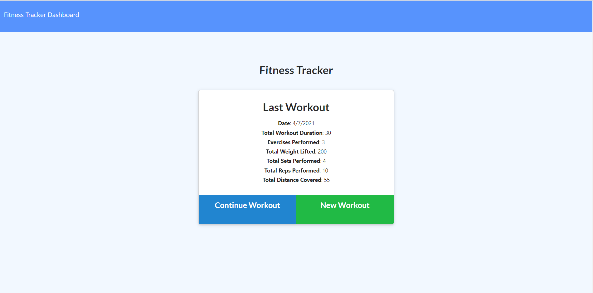

# Workout Tracker

This project allows you input your workout for the day. Simply adding a new workout gives you the option for cardio or resistance type of exercise. You can keep adding more exercises and once you finish adding all your exercises you are taken back to the home page where your totals are added.

On the dashboard you can view all your previos workouts for the past 7 days max which will calculate the total duration and weight for each day. 

Front end code was provided while I worked on the back end connecting to a MongoDB database.

[Link to the Project](https://fast-hollows-86272.herokuapp.com/?id=606de495ce885f001531a971)